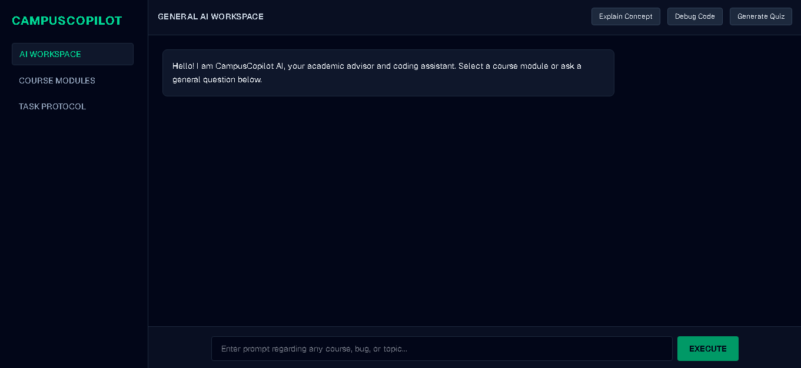
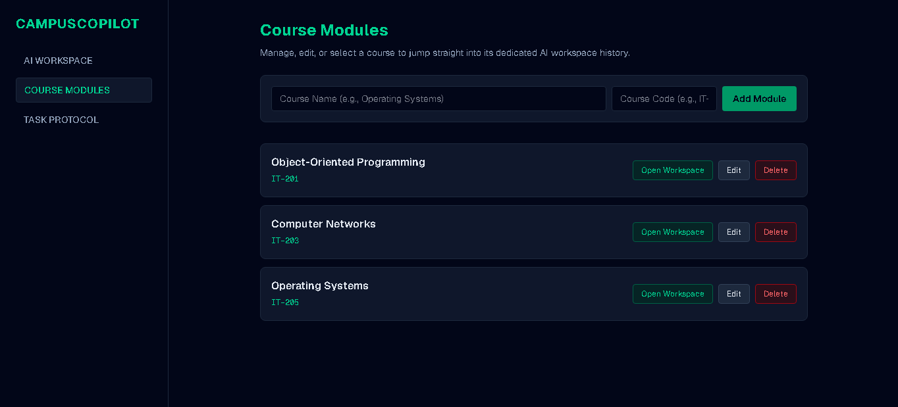
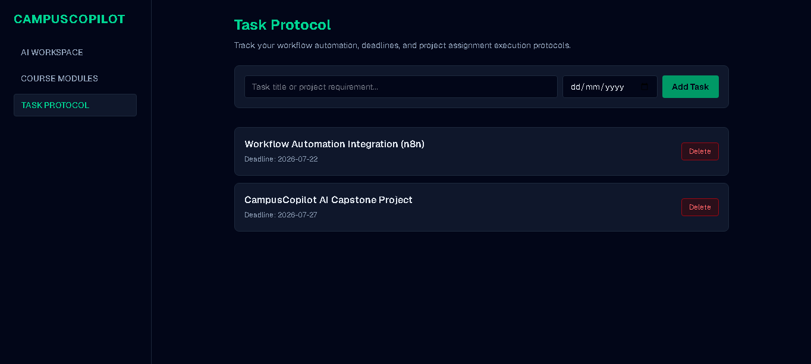

# CampusCopilot AI

## Overview

CampusCopilot AI is an AI-powered academic workspace developed specifically for university IT students. The application combines AI-assisted learning, course module management, and academic task tracking into a single platform, allowing students to manage their studies more efficiently without switching between multiple applications.

The system provides context-aware academic assistance by adapting its responses according to the selected course module, helping students understand technical concepts, solve programming problems, and organize their semester workload.

---

## Problem Statement

University IT students frequently use multiple applications for coding assistance, note-taking, assignment management, and studying. Constantly switching between these tools interrupts productivity and makes academic workflows inefficient.

CampusCopilot AI addresses this problem by providing a centralized workspace where students can receive AI-powered academic assistance, organize semester course modules, and manage assignments and deadlines from one interface.

---

## Target Users

- University IT Students
- Computer Science Students
- Software Engineering Students
- Study Groups
- Students preparing for assignments, quizzes, and examinations

---

## Live Application

https://campus-copilot-ai-eight.vercel.app

---

## GitHub Repository

https://github.com/shehrozsultani/campus-copilot-ai

---

## Features

### AI Academic Workspace

- Ask academic questions using natural language.
- Receive explanations of technical concepts.
- Get programming guidance and debugging assistance.
- Understand difficult coding problems with AI-powered support.

### Module-Specific AI Workspaces

CampusCopilot AI allows students to create dedicated AI workspaces for different semester courses.

Examples include:

- Object-Oriented Programming
- Computer Networks
- Operating Systems
- Database Systems

The AI automatically adapts its responses according to the selected course.

### Dynamic System Prompting

CampusCopilot AI dynamically changes the AI's system instructions based on the selected course module, enabling subject-specific explanations, programming assistance, and academic guidance.

### Task Protocol Tracker

Students can:

- Add academic tasks
- Edit existing tasks
- Delete completed tasks
- Track assignment deadlines
- Organize daily academic activities

### Quick Prompt Actions

Built-in shortcuts allow students to:

- Explain technical concepts
- Review programming code
- Debug coding errors
- Receive subject-specific academic assistance

### Interactive Course Module Management

Students can:

- Add new semester modules
- Edit existing modules
- Delete course modules
- Organize semester subjects within the dashboard

---

## AI Feature

CampusCopilot AI integrates the Google Gemini API to provide intelligent, real-time academic assistance.

### AI Model

- Google Gemini API
- Model: **gemini-3.5-flash**

### System Prompt

```javascript
const systemInstruction = course
  ? `You are CampusCopilot AI, a specialized academic assistant for the course module: ${course}. Provide concise, accurate academic explanations, debugging assistance, programming guidance, and study support tailored to this subject.`
  : `You are CampusCopilot AI, an advanced academic advisor and programming assistant for university IT students.`;
```

The AI dynamically changes its behavior according to the selected course module to provide context-aware academic support.

---

## Technologies Used

| Technology | Purpose |
|------------|---------|
| Next.js (App Router) | Frontend Framework |
| React | User Interface |
| Tailwind CSS | Styling |
| Google Gemini API (`@google/genai`) | AI Integration |
| JavaScript | Programming Language |
| Git & GitHub | Version Control |
| Vercel | Deployment |

---

## Screenshots

### AI Workspace



---

### Course Modules



---

### Task Tracker



---

## Installation

### Clone the Repository

```bash
git clone https://github.com/shehrozsultani/campus-copilot-ai.git
```

### Navigate to the Project Directory

```bash
cd campus-copilot-ai
```

### Install Dependencies

```bash
npm install
```

### Configure Environment Variables

Create a `.env.local` file in the project root and add your Gemini API key:

```env
NEXT_PUBLIC_GEMINI_API_KEY=YOUR_API_KEY
```

### Run the Development Server

```bash
npm run dev
```

Open your browser and visit:

```
http://localhost:3000
```

---

## Project Structure

```text
campus-copilot-ai/
│
├── public/
├── src/
├── ai-workspace.png
├── course-module.png
├── task-protocol.png
├── README.md
├── package.json
└── next.config.mjs
```

---

## Developer

**Shehroz Sultani**

Final Project – CampusCopilot AI

Developed using Next.js, Tailwind CSS, and the Google Gemini API.

---

## License

This project was developed as an individual academic final project for educational purposes.
